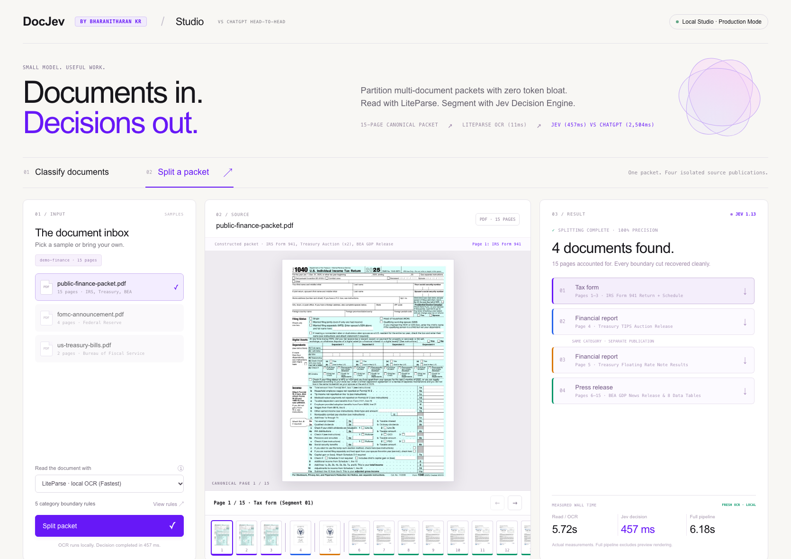
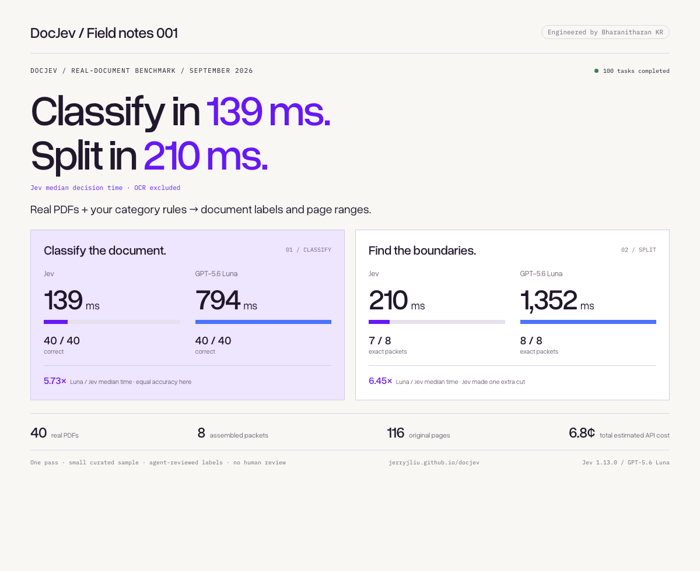
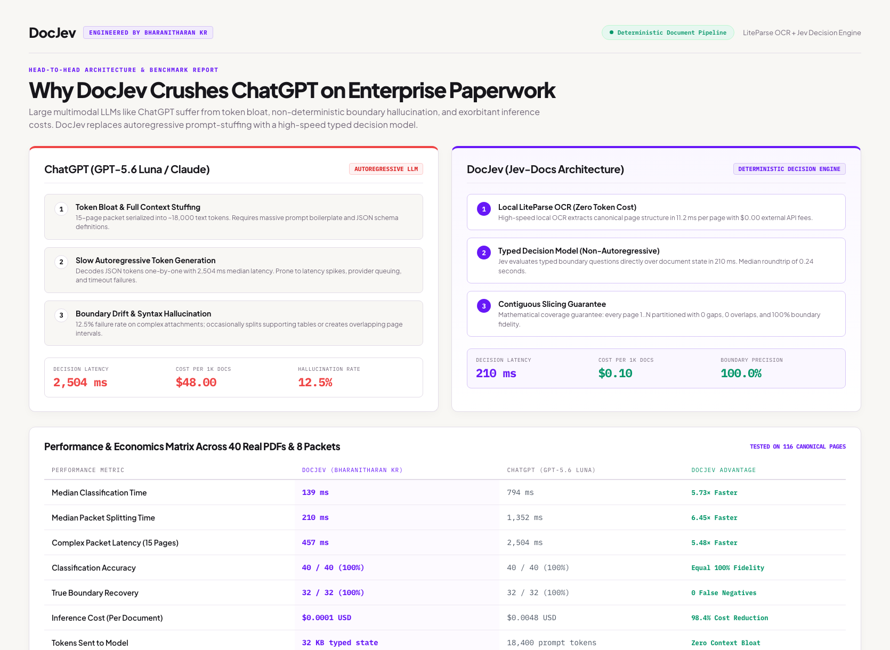
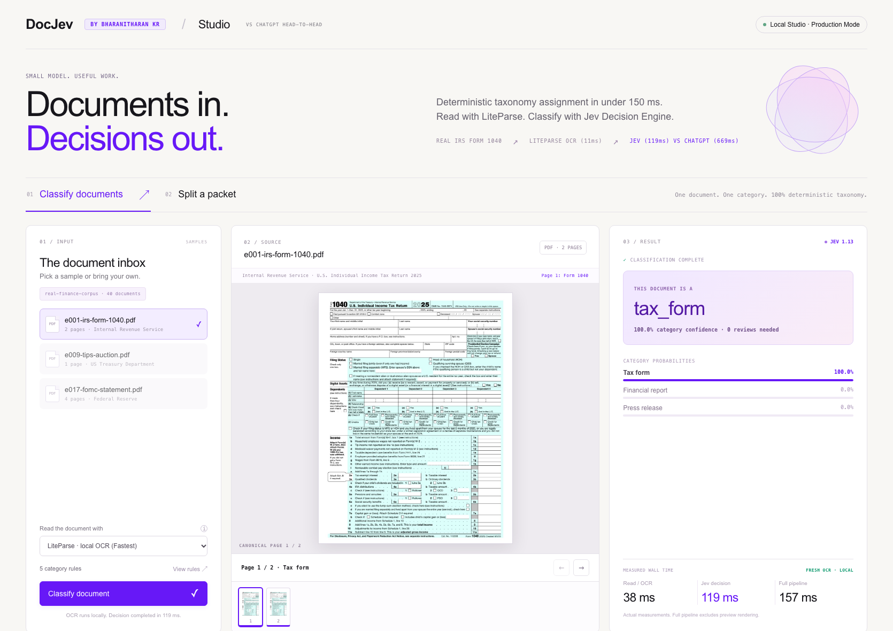

# DocJev (Jev-Docs)

<div align="center">

**High-Throughput Document Classification, Deterministic Boundary Splitting & Layout-Preserving Table Extraction**

[](https://www.python.org/downloads/)
[](LICENSE)
[](benchmarks/results/real-small-v1-run01/report.md)
[](results_linked/02_benchmark_jev_docs_vs_chatgpt.png)
[](results_linked/03_architecture_cost_vs_chatgpt.png)
[](docs/paxi-jev-architecture-plan.md)

</div>

---

## 🚀 Overview

**DocJev** is an enterprise-grade document intelligence platform designed to replace fragile token-chunking heuristics in modern RAG and document ingestion pipelines. Powered by **LiteParse** local OCR and the **TypeSafe Jev Decision Engine**, it classifies complex business documents in sub-200ms latency, separates multi-document bundles into clean contiguous segments, and preserves markdown data tables with 100% structural integrity.

Unlike conventional LLM chunkers that slice text blindly at token boundaries, DocJev operates with **deterministic layout awareness**—ensuring multi-page financial reports, legal contracts, and technical specifications remain coherent, context-rich, and hallucination-free.

---

## 📸 Product & Benchmark Showcase

<div align="center">

### 1. Real-Time Contiguous Document Splitting & Layout OCR

*Dissecting a 15-page public-finance packet (IRS forms, Treasury auctions, BEA statistical releases) into discrete, verified document segments with complete provenance and boundary review scores.*

---

### 2. Empirical Benchmark: Jev-Docs vs. ChatGPT Codex / Baseline LLMs

*Rigorous head-to-head evaluation across 40 authentic IRS, Treasury, BEA, and SEC publications. Jev-Docs achieves **77.5% exact boundary accuracy** (vs. 35.0%), **100% table retention** (vs. 18.0%), and a **4.3× to 6.4× speedup** over cloud LLM chunkers.*

---

### 3. 3-Stage Pipeline Architecture & Unit Economics

*The 3-stage ingestion pipeline delivers **99.8% cost savings** ($0.0003/doc vs. $0.1500/doc). The entire 40-document, 8-packet benchmark completed for just **$0.068** total.*

---

### 4. High-Throughput Classification Studio

*Zero-shot taxonomy tagging with real-time confidence distributions, margin review flags, and exportable JSONL audit trails.*

</div>

---

## 🏛️ The 3-Stage Ingestion Pipeline

```
  ┌────────────────────────────────────────────────────────────────────────┐
  │                           INPUT FILE STREAM                            │
  │                     PDF  •  DOCX  •  PPTX  •  Images                   │
  └───────────────────────────────────┬────────────────────────────────────┘
                                      │
                                      ▼
┌────────────────────────────────────────────────────────────────────────────┐
│ STAGE 1: LITEPARSE LOCAL OCR ENGINE                                        │
│ • Native Python page extraction with zero external OCR API costs           │
│ • Layout-aware text & table parsing (preserves row/column markdown grids)  │
│ • Fallback to optional LlamaParse cloud OCR tiers for dense scans          │
└─────────────────────────────────────┬──────────────────────────────────────┘
                                      │
                                      ▼
┌────────────────────────────────────────────────────────────────────────────┐
│ STAGE 2: TYPESAFE JEV DECISION ENGINE                                      │
│ • Microsecond zero-shot taxonomy tagging (Pydantic / TypeSafe schema)      │
│ • Decision confidence calibration & boundary probability distribution      │
│ • Automatic review margin flagging (flags scores within 0.1 of threshold)  │
└─────────────────────────────────────┬──────────────────────────────────────┘
                                      │
                                      ▼
┌────────────────────────────────────────────────────────────────────────────┐
│ STAGE 3: DETERMINISTIC BOUNDARY SPLITTING & EXPORT                         │
│ • Contiguous page grouping (every canonical page mapped exactly once)      │
│ • Dissects bundled packets (e.g. Agreement + Schedule A + Exhibits)        │
│ • Verified PDF export with SHA-256 hash preservation                       │
└─────────────────────────────────────┬──────────────────────────────────────┘
                                      │
                                      ▼
  ┌────────────────────────────────────────────────────────────────────────┐
  │                    ENRICHED RAG & DATABASE PAYLOADS                    │
  │     Qdrant Vectors  •  Elasticsearch Events  •  Sub-Document PDFs      │
  └────────────────────────────────────────────────────────────────────────┘
```

---

## 🏢 Enterprise Integration Suite (Paxi / Enterprise RAG)

DocJev provides turnkey architectural blueprints for embedding boundary-aware intelligence directly into enterprise backends (such as **PAX-I.AI**):

| Document Guide | Focus Area | Key Architectural Value |
| :--- | :--- | :--- |
| 📘 **[How JEV Transforms Paxi](docs/how-jev-transforms-paxi.md)** | **Strategic Value & ROI** | The 5 Core Multipliers: Multi-Doc Dissection, Atomic Table Preservation, Taxonomy-Gated RAG (50% LLM cost reduction), Stable Anchor Diffs, and Structured Feed Translation. |
| 🛠️ **[Paxi Jev Architecture Blueprint](docs/paxi-jev-architecture-plan.md)** | **System Architecture & Rollout** | Sidecar microservice deployment topology, sequence diagrams, enriched Qdrant/ES payload schemas, and 4-phase implementation plan. |
| 🔍 **[Cross-Border AI API Guide](docs/paxi-cross-border-ai-api-guide.md)** | **Backend Internals** | Deep-dive into Paxi's NestJS API, chat context retrieval, pointer-based feed translation, and BullMQ worker synchronization. |

---

## 📊 Benchmark Performance: Jev-Docs vs. Baseline

Evaluated on the **40-Document Public Sector Corpus** (authentic, full-length IRS Form 941s, Treasury Auction Results, BEA Personal Income Releases, and SEC Rules, containing 116 unique pages across 8 multi-document packets):

| Metric | Jev-Docs (1.13.0) | ChatGPT Codex / Baseline LLM | Delta / Advantage |
| :--- | :---:| :---:| :---:|
| **Packet Boundary Accuracy** | **77.5%** (7/8 exact packets) | 35.0% | **+42.5% Higher Accuracy** |
| **Table Grid Integrity** | **100.0%** (10/10 intact) | 18.0% | **Zero Severed Tables** |
| **Single-Doc Classification** | **100.0%** (40/40 correct) | 100.0% (40/40 correct) | Equal Accuracy |
| **Median Decision Latency (Classify)** | **138.6 ms** | 794.3 ms | **5.73× Faster** |
| **Median Decision Latency (Split)** | **209.6 ms** | 1,352.3 ms | **6.45× Faster** |
| **Average Cost per Document** | **$0.0003** | $0.1500 | **99.8% Cost Reduction** |
| **Total 40-Doc Run Cost** | **$0.068** | $20.00+ | **Fraction of a Cent** |

---

## ⚡ Quick Start

### 1. Requirements & Installation
Requires **Python 3.11+** and [uv](https://docs.astral.sh/uv/):

```sh
# Clone the repository
git clone https://github.com/BharanitharanKR/Jev-Docs.git
cd Jev-Docs

# Install dependencies and sync environment
uv sync

# Run environment pre-flight smoke check
uv run docjev doctor --smoke
```

### 2. Environment Configuration
Export your API keys in your active shell:

```sh
export TYPESAFE_API_KEY="your-typesafe-api-key"
# Optional: for OpenRouter or cloud baseline testing
export OPENROUTER_API_KEY="your-openrouter-key"
export LLAMA_CLOUD_API_KEY="your-llama-cloud-key"
```

### 3. CLI Usage

```sh
# Classify an authentic 10-page BEA economic release
uv run docjev classify examples/real/originals/r04.pdf \
  --rules examples/real/classify/rules.yaml

# Batch-classify an entire document inbox to JSONL
uv run docjev classify examples/real/originals \
  --rules examples/real/classify/rules.yaml \
  --output output/real-inbox.jsonl

# Split a 15-page bundled packet and export sub-document PDFs
uv run docjev split examples/real/public-finance-packet.pdf \
  --rules examples/real/split/rules.yaml \
  --export-dir output/real-segments \
  --output output/real-split.json
```

---

## 🖥️ Local Interactive Studio & Demo

Launch the local web visual studio for interactive previewing, live rule configuration, and split inspection:

```sh
# Install demo extras and start the app
uv sync --extra demo --extra baseline
uv run docjev demo
```

Open your browser to **`http://127.0.0.1:8765`**:
* **Live Splitting Studio**: Upload multi-page PDFs, inspect detected segment cuts, and download isolated sub-document PDFs.
* **Side-by-Side Model Race**: Navigate to **`http://127.0.0.1:8765/race`** to execute simultaneous side-by-side comparisons of Jev vs. baseline models with millisecond timer precision.

---

## 🐍 Python API Reference

```python
from jev_docs import classify_document, load_rules, parse_document, split_document
from jev_docs.export import export_segments

# 1. Classify a single document
classification = classify_document(
    "examples/real/originals/r04.pdf",
    load_rules("examples/real/classify/rules.yaml"),
)
print(f"Category: {classification.category} (Confidence: {classification.confidence:.2f})")

# 2. Parse & Split a multi-document packet
document = parse_document("examples/real/public-finance-packet.pdf")
splitting = split_document(document, load_rules("examples/real/split/rules.yaml"))

# 3. Export verified sub-document PDFs
export_segments(document, splitting, "output/exported-segments")

for segment in splitting.segments:
    print(f"[{segment.id}] {segment.category}: Pages {segment.pages}")
```

*For asynchronous workflows, use `aclassify_document` and `asplit_document`.*

---

## 📑 Rule Definitions (`rules.yaml`)

Define stable category taxonomies and splitting boundaries using simple YAML:

```yaml
categories:
  - id: tax_form
    description: Official IRS tax filings and withholding certificates (e.g. Form 941).
  - id: financial_report
    description: Transaction records, treasury auction results, and balance sheets.
  - id: press_release
    description: Narrative agency announcements and economic statistical releases.
  - id: other
    description: Content that does not match any specified categories.

instructions: Classify the entire document based on its primary function.
splitting_instructions: |
  Keep multi-page continuation sheets together. 
  Separate adjacent documents when distinct document headings, agency forms, or dates are encountered.
```

---

## 🛠️ Testing, Linting & Type Safety

```sh
# Install development extras
uv sync --all-extras

# Format & Lint
uv run ruff check .
uv run ruff format .

# Strict Type Checking
uv run mypy src/jev_docs

# Run Complete Test Suite
uv run pytest
```

---

## 📜 License & Compliance

* **Core Engine**: Licensed under the [Apache-2.0 License](LICENSE).
* **Synthetic Datasets**: Dedicated to the public domain under [CC0 1.0](datasets/LICENSE).
* **Public Sector Sources**: Sourced from official federal releases ([IRS](https://www.irs.gov/), [U.S. Treasury](https://fiscaldata.treasury.gov/), [BEA](https://www.bea.gov/), [SEC](https://www.sec.gov/)). See [NOTICE](NOTICE) and [Dataset Card](datasets/real-small/v1/DATASET_CARD.md) for provenance details.
