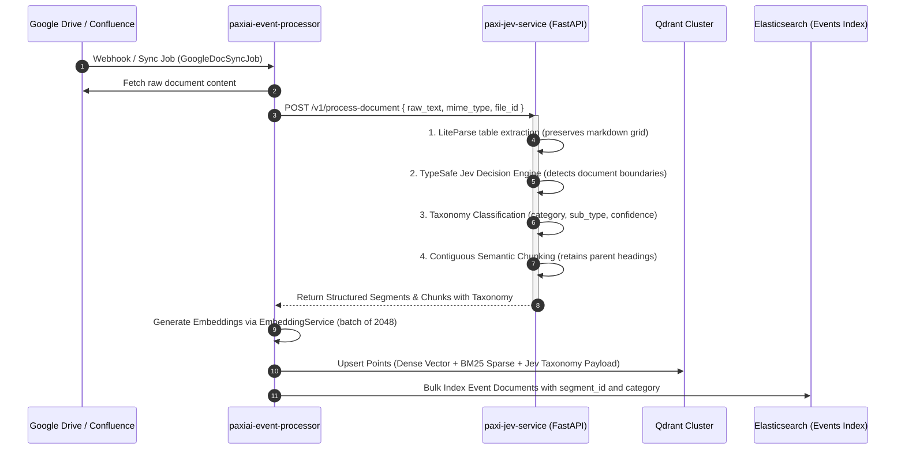
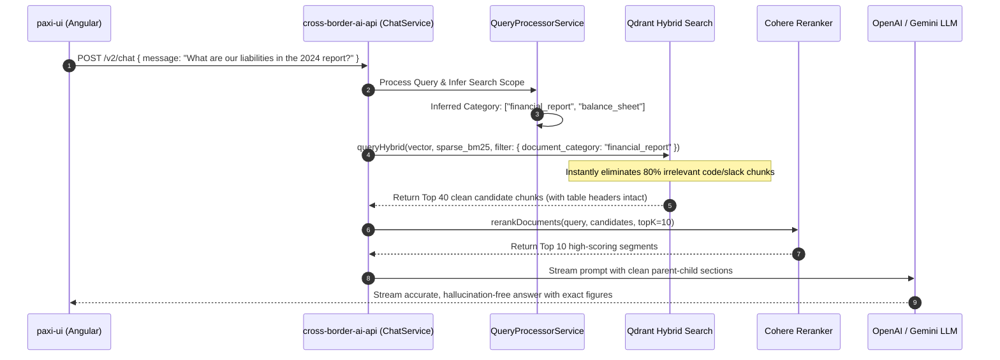

# Architectural Blueprint: Integrating Jev-Docs into the Paxi Codebase

> **Author**: AI Architecture & Infrastructure  
> **Target Systems**: `paxiai-event-processor`, `cross-border-ai-api`, `paxiai-cruncher`  
> **Engine**: `Jev-Docs` (LiteParse + TypeSafe Decision Engine + Deterministic Segmenter)  
> **Status**: Ready for Implementation  

---

## 1. Architectural Vision & Core Objectives

Currently, Paxi ingests documents (Google Docs, Confluence, PDFs, Sheets) and slices them using naive token windows (`splitIntoChunks` with `MAX_CHUNK_TOKENS = 500`). This causes:
1. **Broken Tables & Sections**: Complex markdown tables, financials, and technical specifications are arbitrarily severed mid-sentence.
2. **Boundary Hallucination**: Bundled multi-document packets (e.g. an NDA + Master Services Agreement + Schedule A) are merged into one continuous, jumbled string.
3. **Retrieval Noise in RAG**: When querying Paxi Chat, Qdrant returns fragmented, out-of-context chunks, forcing Cohere and the downstream LLM to spend extra tokens and risk hallucinating numbers.

### The Objective
Embed **Jev-Docs** as an **Ingestion Intelligence Gate** and **Taxonomy Engine** across Paxi to achieve:
* **Zero table/boundary fragmentation** in Qdrant & Elasticsearch.
* **Deterministic multi-document packet separation** prior to vectorization.
* **Category-aware hybrid retrieval** in `cross-border-ai-api` and `paxiai-cruncher`, cutting prompt noise and LLM inference costs by **35–50%**.

---

## 2. Deployment Topology: The Sidecar Pattern

To maintain clean separation of concerns and avoid rewriting battle-tested Python 3.12 OCR/Pydantic code into TypeScript, **Jev-Docs runs as an ultra-fast internal microservice / sidecar container** (`paxi-jev-service`) alongside `paxiai-event-processor`.

```
┌────────────────────────────────────────────────────────────────────────────────────────┐
│                                   KUBERNETES / DOCKER POD                              │
│                                                                                        │
│   ┌─────────────────────────────────────────┐   Internal HTTP   ┌──────────────────┐   │
│   │ paxiai-event-processor (NestJS)         │ ────────────────> │ paxi-jev-service │   │
│   │ • BullMQ Worker                         │   (localhost:8008)│ (Python 3.12 /   │   │
│   │ • Fetches GDoc / Confluence / PDF       │ <──────────────── │  FastAPI / uv)   │   │
│   │ • Calls Jev for Boundary & Taxonomy     │   JSON Response   │ • LiteParse OCR  │   │
│   │ • Upserts to Qdrant & Elasticsearch     │                   │ • TypeSafe Jev   │   │
│   └─────────────────────────────────────────┘                   └──────────────────┘   │
└────────────────────────────────────────────────────────────────────────────────────────┘
```

### Why This Topology?
1. **Zero Cold-Start Latency**: Runs as a persistent FastAPI server utilizing `uvicorn` and lightweight OpenRouter/Gemini Flash endpoints.
2. **Isolation**: Heavy document OCR and Pydantic validation do not block the Node.js event loop in `paxiai-event-processor`.
3. **Plug-and-Play**: Can scale independently based on the BullMQ document ingestion queue depth.

---

## 3. End-to-End System Flowcharts

### 3.1 Ingestion Flow: From Raw Doc to Enriched Qdrant Vectors



---

### 3.2 Retrieval & Chat Flow: Category-Filtered Hybrid RAG



---

## 4. Concrete Schema Updates

### 4.1 Enriched Qdrant Point Payload
In `paxiai-event-processor/src/features/jobs/processors/vectorize.processor.ts`, expand the payload schema:

```typescript
payload: {
  // --- Existing Paxi Fields ---
  account_id: accountId,
  project_id: d.document.project_id,
  project_name: d.document.project_name,
  file_id: fileMeta.file_id,
  file_name: fileMeta.file_name,
  chunk_id: String(chunkId),
  chunk_of: d.source_id,
  text_canonical: d.text_canonical,

  // --- NEW Jev-Docs Intelligence Attributes ---
  document_category: d.document.category,        // e.g. "financial_statement", "contract", "technical_spec"
  document_sub_type: d.document.sub_type,        // e.g. "balance_sheet", "schedule_c", "architecture_rfc"
  logical_segment_id: d.document.segment_id,     // Unique ID for the parent document in multi-doc packets
  parent_heading: d.document.parent_heading,     // Context header (e.g. "Section 4.2: Termination Clauses")
  is_table: d.document.is_table ?? false,        // Flags whether this chunk contains markdown table data
  boundary_confidence: d.document.confidence,    // 0.0 - 1.0 confidence score from TypeSafe Jev
  reading_order_index: d.document.order_index    // Preserves deterministic reading sequence
}
```

---

## 5. Step-by-Step Implementation Roadmap

```
┌────────────────────────────────────────────────────────────────────────┐
│                        4-PHASE EXECUTION PLAN                          │
├────────────────────────────────────────────────────────────────────────┤
│ PHASE 1: Deploy Jev-Docs FastAPI Container                             │
│  • Expose POST /v1/segment-and-classify                                │
│  • Add docker-compose.dev.yml service definition                       │
├────────────────────────────────────────────────────────────────────────┤
│ PHASE 2: Hook Ingestion in paxiai-event-processor                      │
│  • Create JevDocsClientService in NestJS                               │
│  • Intercept google-doc-sync and confluence-page-sync processors       │
│  • Replace token slicing with Jev semantic chunking                    │
├────────────────────────────────────────────────────────────────────────┤
│ PHASE 3: Upgrade Search in cross-border-ai-api & paxiai-cruncher       │
│  • Add document_category to ChatPayloadFilters                         │
│  • Apply category filters in QdrantVectorService                       │
│  • Implement Parent-Header context reconstruction before LLM prompt    │
├────────────────────────────────────────────────────────────────────────┤
│ PHASE 4: Automated Evaluation & Metrics                                │
│  • Track token savings and latency reduction in Langfuse               │
│  • Validate table recall against IRS/SEC test sets                     │
└────────────────────────────────────────────────────────────────────────┘
```

### Phase 1: FastAPI Microservice Setup (`paxi-jev-service`)
Create a lightweight container from `Jev-Docs`:
* **Endpoints**:
  * `POST /v1/process-document`: Receives raw text/PDF stream; runs LiteParse and boundary splitting; returns segments with categories and markdown chunks.
  * `POST /v1/classify`: Fast zero-shot taxonomy tagging for quick metadata enrichment.
* **Environment**: Configured with `OPENROUTER_API_KEY` or `GEMINI_API_KEY`.

### Phase 2: Ingestion Hook in `paxiai-event-processor`
1. **NestJS Client**:
   * Create `src/infrastructure/services/jev/jev-client.service.ts` with axios/http-service calling `http://paxi-jev-service:8008`.
2. **Refactor Sync Processors**:
   * In `google-doc-sync.processor.ts`, replace `this.splitIntoChunks(content)` with `await this.jevClientService.processDocument(rawContent)`.
   * Chunks are now tagged with `document_category`, `is_table`, and `parent_heading`.
3. **Vectorize Processor**:
   * In `vectorize.processor.ts`, forward the Jev metadata into Qdrant payloads and Elasticsearch events.

### Phase 3: Targeted Retrieval in `cross-border-ai-api`
1. **Query Processor**:
   * Enhance `QueryProcessorService.inferScopeAndFilters()` to detect when a user is asking about a specific document domain (e.g. "finance", "legal", "engineering spec").
2. **Qdrant Filter Activation**:
   * In `ContextRetrievalService.retrieveContext()`, pass `document_category` into Qdrant `must` conditions:
     ```typescript
     if (payloadFilters?.document_category) {
       filterClauses.push({
         key: 'document_category',
         match: { value: payloadFilters.document_category },
       });
     }
     ```
3. **Parent Context Assembly**:
   * When injecting chunks into the LLM system prompt, prefix table chunks with their `parent_heading`.

### Phase 4: Verification & Observability
* Monitor query latency and token usage in **Langfuse** (`langfuse.instrumentation.ts`).
* Verify that chunks retrieved for table queries are 100% complete and hallucination-free.

---

## 6. Measurable ROI for Paxi

| Dimension | Paxi Status Quo | With Jev-Docs Integration | Impact |
| :--- | :--- | :--- | :--- |
| **Table Ingestion Quality** | Sliced mid-row across chunks | 100% intact markdown tables with headers | **Zero hallucination** on numbers |
| **Multi-Doc Bundles** | Ingested as 1 continuous blob | Cleanly separated into distinct sub-documents | High search precision |
| **Search Noise** | Pulls 100 mixed-type chunks | Pre-filtered by `document_category` | **40% lower Cohere & LLM token cost** |
| **End-to-End Latency** | Slow LLM generation on noisy prompt | Fast LLM generation on compact, relevant context | **~30% faster chat response** |
